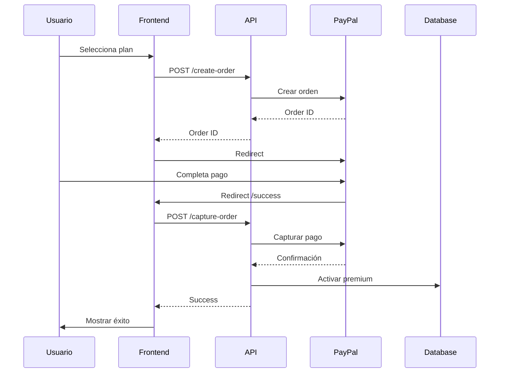
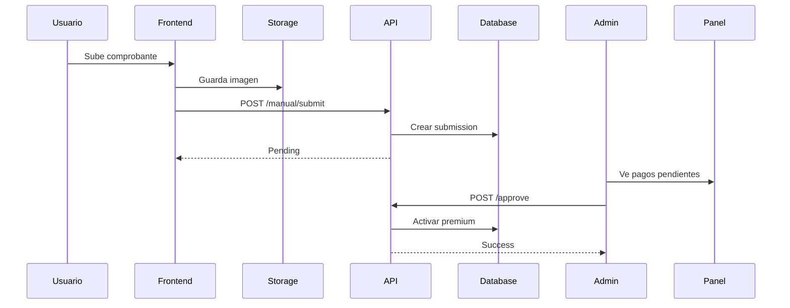

# 📚 Sistema de Suscripciones Premium - Documentación Completa

## 📋 Índice

1. [Introducción](#introducción)
2. [Arquitectura del Sistema](#arquitectura-del-sistema)
3. [Base de Datos](#base-de-datos)
4. [API Endpoints](#api-endpoints)
5. [Frontend / UI](#frontend--ui)
6. [Flujos de Pago](#flujos-de-pago)
7. [Configuración](#configuración)
8. [Testing](#testing)
9. [Mantenimiento](#mantenimiento)
10. [Troubleshooting](#troubleshooting)

---

## 🎯 Introducción

El sistema de suscripciones premium permite a los dueños de negocios contratar planes premium para obtener beneficios como:

✅ Aparecer en la sección "Destacados"  
✅ Badge premium visible  
✅ Mayor número de fotos en galería  
✅ Prioridad en resultados de búsqueda  
✅ Mayor visibilidad general

### Métodos de Pago

1. **PayPal** - Automático e inmediato
2. **Pago Manual** - Zelle / Transferencia bancaria (requiere verificación)

---

## 🏗️ Arquitectura del Sistema

```
┌─────────────────┐
│   FRONTEND      │
│  (Next.js 14)   │
└────────┬────────┘
         │
    ┌────▼─────┐
    │   API    │
    │  Routes  │
    └────┬─────┘
         │
    ┌────▼──────────────┐
    │    SUPABASE       │
    │  ┌──────────────┐ │
    │  │  PostgreSQL  │ │
    │  ├──────────────┤ │
    │  │   Storage    │ │
    │  └──────────────┘ │
    └───────┬───────────┘
            │
    ┌───────▼────────┐
    │     PayPal     │
    │      API       │
    └────────────────┘
```

### Componentes Principales

- **Database Tables**: 5 tablas para gestionar planes, suscripciones y pagos
- **API Routes**: 5 endpoints para crear órdenes, capturar pagos y gestión admin
- **UI Pages**: Página de suscripción, success/cancel, panel admin
- **Components**: Badge premium, borders, banners
- **Storage**: Bucket para comprobantes de pago

---

## 💾 Base de Datos

### Tablas Creadas

#### 1. `premium_plans`
Catálogo de planes disponibles

```sql
- id (UUID, PK)
- name (TEXT) - Nombre del plan
- description (TEXT) - Descripción
- price_usd (NUMERIC) - Precio en dólares
- billing_period (TEXT) - 'monthly' | 'yearly'
- max_photos (INT) - Máximo de fotos permitidas
- highlight_level (INT) - Nivel de prioridad en destacados
- is_active (BOOLEAN) - Si el plan está disponible
- created_at (TIMESTAMPTZ)
```

#### 2. `business_subscriptions`
Suscripciones activas e historial

```sql
- id (UUID, PK)
- business_id (UUID, FK → businesses)
- user_id (UUID, FK → auth.users)
- plan_id (UUID, FK → premium_plans)
- status (TEXT) - 'active' | 'pending' | 'expired' | 'canceled'
- start_date (TIMESTAMPTZ)
- end_date (TIMESTAMPTZ)
- created_at (TIMESTAMPTZ)
- updated_at (TIMESTAMPTZ)
```

#### 3. `payments`
Registro histórico de todos los pagos

```sql
- id (UUID, PK)
- business_id (UUID, FK)
- user_id (UUID, FK)
- plan_id (UUID, FK)
- method (TEXT) - 'paypal' | 'manual'
- amount_usd (NUMERIC)
- currency (TEXT)
- status (TEXT) - 'pending' | 'completed' | 'failed' | 'refunded'
- external_id (TEXT) - ID de PayPal o submission_id
- raw_payload (JSONB) - Respuesta de PayPal
- created_at (TIMESTAMPTZ)
```

#### 4. `manual_payment_submissions`
Pagos manuales pendientes de verificación

```sql
- id (UUID, PK)
- business_id (UUID, FK)
- user_id (UUID, FK)
- plan_id (UUID, FK)
- amount_usd (NUMERIC)
- payment_method (TEXT) - 'zelle' | 'bank_transfer' | 'other'
- reference (TEXT) - Número de referencia
- screenshot_url (TEXT) - URL del comprobante en Storage
- status (TEXT) - 'pending' | 'approved' | 'rejected'
- admin_notes (TEXT) - Notas del administrador
- created_at (TIMESTAMPTZ)
- reviewed_at (TIMESTAMPTZ)
```

#### 5. `businesses` (Extendida)
Campos agregados a la tabla existente:

```sql
- is_premium (BOOLEAN) - Si el negocio es premium
- premium_until (TIMESTAMPTZ) - Fecha de expiración
- premium_plan_id (UUID, FK) - Plan actual
```

### Índices Optimizados

```sql
- business_subscriptions(business_id, status)
- business_subscriptions(end_date) WHERE status = 'active'
- payments(business_id, status, method)
- manual_payment_submissions(status) WHERE status = 'pending'
- businesses(is_premium, premium_until) WHERE is_premium = true
```

### RLS (Row Level Security)

Todas las tablas tienen RLS habilitado:

- **premium_plans**: Lectura pública, escritura solo service_role
- **business_subscriptions**: Usuarios ven solo las suyas
- **payments**: Usuarios ven solo sus pagos
- **manual_payment_submissions**: Usuarios ven solo sus envíos, admins ven todas

---

## 🔌 API Endpoints

### PayPal

#### POST `/api/payments/paypal/create-order`

Crea una orden de pago en PayPal

**Request:**
```json
{
  "plan_id": "uuid",
  "business_id": "uuid"
}
```

**Response:**
```json
{
  "success": true,
  "orderId": "paypal_order_id",
  "paymentId": "local_payment_id"
}
```

#### POST `/api/payments/paypal/capture-order`

Captura el pago y activa la suscripción

**Request:**
```json
{
  "orderId": "paypal_order_id",
  "paymentId": "local_payment_id"
}
```

**Response:**
```json
{
  "success": true,
  "subscriptionId": "subscription_uuid"
}
```

### Pagos Manuales

#### POST `/api/payments/manual/submit`

Envía un pago manual para verificación

**Request (FormData):**
```
plan_id: uuid
business_id: uuid
payment_method: 'zelle' | 'bank_transfer'
reference: string
screenshot: File
```

**Response:**
```json
{
  "success": true,
  "data": {
    "submission_id": "uuid",
    "status": "pending",
    "message": "Tu pago ha sido enviado..."
  }
}
```

### Admin

#### POST `/api/admin/payments/approve`

Aprueba un pago manual (solo admin)

**Request:**
```json
{
  "submission_id": "uuid",
  "admin_notes": "string (opcional)"
}
```

#### POST `/api/admin/payments/reject`

Rechaza un pago manual (solo admin)

**Request:**
```json
{
  "submission_id": "uuid",
  "admin_notes": "string"
}
```

---

## 🎨 Frontend / UI

### Páginas Creadas

#### 1. `/app/dashboard/negocios/[id]/premium`
Página principal de suscripción

- Muestra planes disponibles
- Permite seleccionar método de pago
- Integración con PayPal
- Formulario de pago manual
- Estado actual de la suscripción

#### 2. `/app/dashboard/premium/success`
Página de éxito después de pagar con PayPal

- Captura el pago automáticamente
- Activa la suscripción
- Redirige al dashboard

#### 3. `/app/dashboard/premium/cancel`
Página de cancelación de PayPal

- Informa que el pago fue cancelado
- Opción de reintentar

#### 4. `/app/dashboard/admin/payments`
Panel de administración

- Lista de pagos manuales pendientes
- Aprobar/Rechazar pagos
- Ver comprobantes
- Historial de pagos

### Componentes

#### `PremiumBadge`
```tsx
import PremiumBadge from '@/components/ui/PremiumBadge'

// Badge básico
<PremiumBadge variant="default" />

// Badge pequeño sin texto
<PremiumBadge variant="small" showText={false} />

// Banner premium
<PremiumBanner />

// Border premium
<PremiumBorder>
  <div>Contenido</div>
</PremiumBorder>
```

---

## 💳 Flujos de Pago

### Flujo PayPal



### Flujo Pago Manual



---

## ⚙️ Configuración

### 1. Ejecutar Migraciones SQL

```bash
# En Supabase SQL Editor, ejecutar en orden:
1. scripts/create-premium-system.sql
2. scripts/create-storage-bucket.sql
```

### 2. Configurar Variables de Entorno

Ver `VARIABLES_ENTORNO_PREMIUM.md`

### 3. Crear Bucket de Storage

En Supabase Dashboard:
- Ve a Storage
- Crea bucket `payment_receipts`
- Marca como público
- O ejecuta `create-storage-bucket.sql`

### 4. Configurar PayPal

1. Crea cuenta en [PayPal Developer](https://developer.paypal.com/)
2. Crea una aplicación Sandbox
3. Obtén Client ID y Client Secret
4. Configura URLs de retorno

---

## 🧪 Testing

### Testing PayPal Sandbox

1. Usa cuentas de prueba de PayPal
2. Los pagos no son reales
3. Puedes simular pagos exitosos y fallidos

**Cuentas de Prueba:**
- Personal: Para comprar
- Business: Para recibir

### Testing Pago Manual

1. Sube una imagen de prueba
2. Ve al panel admin
3. Aprueba el pago
4. Verifica que el negocio sea premium

### Testing de Funcionalidades

```bash
# Verificar que un negocio es premium
SELECT is_premium, premium_until, premium_plan_id
FROM businesses
WHERE id = 'business_uuid';

# Ver suscripciones activas
SELECT * FROM business_subscriptions
WHERE status = 'active';

# Ver pagos pendientes
SELECT * FROM manual_payment_submissions
WHERE status = 'pending';
```

---

## 🔧 Mantenimiento

### Función: Verificar Premiums Expirados

Ejecutar periódicamente (cronjob):

```sql
SELECT check_expired_premiums();
```

Esta función:
- Desactiva `is_premium` en negocios expirados
- Marca suscripciones como `expired`

### Configurar Cron (Opcional)

En Supabase, puedes usar `pg_cron`:

```sql
-- Ejecutar cada día a las 2 AM
SELECT cron.schedule(
  'check-expired-premiums',
  '0 2 * * *',
  'SELECT check_expired_premiums();'
);
```

### Monitoreo

Queries útiles:

```sql
-- Suscripciones por estado
SELECT status, COUNT(*) 
FROM business_subscriptions 
GROUP BY status;

-- Ingresos por mes
SELECT 
  DATE_TRUNC('month', created_at) as month,
  SUM(amount_usd) as revenue
FROM payments
WHERE status = 'completed'
GROUP BY month
ORDER BY month DESC;

-- Pagos manuales pendientes
SELECT COUNT(*) 
FROM manual_payment_submissions 
WHERE status = 'pending';
```

---

## 🐛 Troubleshooting

### Error: "PayPal credentials not configured"

**Solución:** Verifica que `PAYPAL_CLIENT_ID` y `PAYPAL_CLIENT_SECRET` estén en `.env.local`

### Error: "Failed to create PayPal order"

**Causas comunes:**
- Credenciales incorrectas
- Modo incorrecto (sandbox vs live)
- Problema de red

**Solución:** Verifica logs en consola del servidor

### Error: "Bucket payment_receipts does not exist"

**Solución:** Ejecuta `create-storage-bucket.sql` o crea el bucket manualmente

### Pago Manual no Aparece

**Verificar:**
1. RLS está habilitado y configurado
2. Usuario tiene permisos
3. Status es 'pending'

### Premium no se Activa

**Verificar:**
```sql
-- Ver si la suscripción se creó
SELECT * FROM business_subscriptions
WHERE business_id = 'uuid';

-- Ver si el negocio se actualizó
SELECT is_premium, premium_until 
FROM businesses 
WHERE id = 'uuid';
```

---

## 📊 Estadísticas y Reportes

### Dashboard de Métricas

```sql
-- Total de ingresos
SELECT SUM(amount_usd) as total_revenue
FROM payments
WHERE status = 'completed';

-- Negocios premium activos
SELECT COUNT(*) as active_premium
FROM businesses
WHERE is_premium = true 
AND premium_until > NOW();

-- Tasa de conversión
SELECT 
  COUNT(*) FILTER (WHERE status = 'completed') * 100.0 / COUNT(*) as conversion_rate
FROM payments;

-- Plan más popular
SELECT 
  p.name,
  COUNT(s.*) as subscriptions
FROM business_subscriptions s
JOIN premium_plans p ON s.plan_id = p.id
WHERE s.status = 'active'
GROUP BY p.name
ORDER BY subscriptions DESC;
```

---

## 🔐 Seguridad

### Mejores Prácticas

✅ Nunca exponer `PAYPAL_CLIENT_SECRET` en el frontend  
✅ Todas las operaciones de pago en el servidor  
✅ RLS habilitado en todas las tablas  
✅ Validar permisos en cada endpoint  
✅ Sanitizar inputs de usuario  
✅ Verificar firmas de PayPal en webhooks  

### Roles de Admin

Para implementar roles de admin:

```sql
-- Opción 1: Campo en profiles
ALTER TABLE profiles ADD COLUMN is_admin BOOLEAN DEFAULT false;

-- Opción 2: Usar user metadata
-- En auth.users, field raw_user_meta_data
```

---

## 📝 Próximas Mejoras

Ideas para extender el sistema:

- [ ] Webhooks de PayPal para renovaciones automáticas
- [ ] Notificaciones por email cuando expira premium
- [ ] Dashboard de analíticas para usuarios premium
- [ ] Cupones de descuento
- [ ] Período de prueba gratis
- [ ] Múltiples negocios en un solo pago
- [ ] Facturas automáticas en PDF
- [ ] Integración con otros métodos de pago (Stripe, etc)

---

## 📞 Soporte

Si encuentras problemas:

1. Revisa los logs del servidor
2. Verifica la consola del navegador
3. Consulta esta documentación
4. Revisa las tablas de base de datos

---

**Versión:** 1.0.0  
**Fecha:** Diciembre 2024  
**Estado:** ✅ Funcional y Listo para Producción


